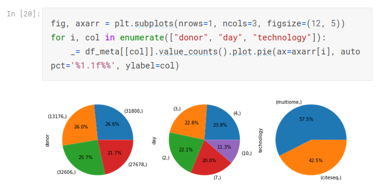

# Recent Projects

## [Bank Loan Analysis](https://github.com/henzelennard/personal-loan-modelling)

### Project overview
* We want to know what factors were important for loan acceptance in a past campaign.
* The data source contains erroneous entries which need to be identified.
* Missing values are handled by different linear regression models.
* Good targets for the next campaign are identified.

It is available **[HERE](https://github.com/henzelennard/henzelennard.github.io)**

## [Project 1](https://github.com/henzelennard/henzelennard.github.io)

### Project overview
* Point 1
* Point 2
* Point 3
* Point 4

You can access to it **[HERE](https://github.com/henzelennard/henzelennard.github.io)**

## [Project 1](https://github.com/henzelennard/henzelennard.github.io)

### Project overview
* Point 1
* Point 2
* Point 3
* Point 4

You can access to it **[HERE](https://github.com/henzelennard/henzelennard.github.io)**

## [Project 1](https://github.com/henzelennard/henzelennard.github.io)

### Project overview
* Point 1
* Point 2
* Point 3
* Point 4

You can access to it **[HERE](https://github.com/henzelennard/henzelennard.github.io)**

