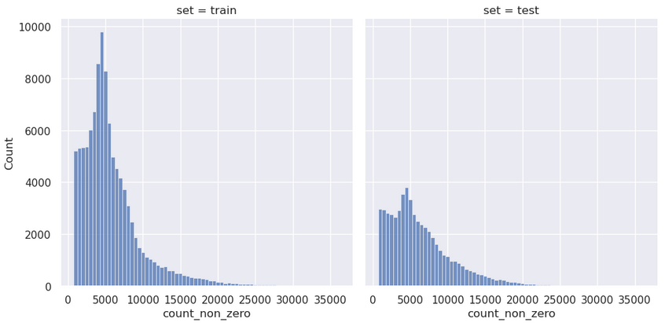

# Status
I'm currently looking for a project starting in October!

# About
As a studied mathematician with more than 5 years of expertise in software development, I assist businesses in the fields of data science. My areas of expertise include the extraction of relevant data, further processing (ETL processes), and the development of models for machine learning.

# Recent Projects

## [Bank Loan Campaign Review](https://github.com/henzelennard/personal-loan-modelling)

### Project overview
* We want to know what factors were important for loan acceptance in a past campaign.
* The data source contains erroneous entries which need to be identified.
* Missing values are handled by different linear regression models.
* Good targets for the next campaign are identified.

It is available **[HERE](https://github.com/henzelennard/henzelennard.github.io)**

## [Cell Modality Analysis](https://github.com/henzelennard/multimodal-single-cell-integration)

### Project overview
* In genetics, there is a recognized information flow from DNA to RNA to proteins.
* The ability to forecast other modalities in the same cell using information from one modality is predicted.
* This project includes data from about 200k cells, each of which has up to 220k features.
* Prediction models are developed based on the analysis of this enormous data (more than 20 billion data points).

It is available **[HERE](https://github.com/henzelennard/multimodal-single-cell-integration)**

